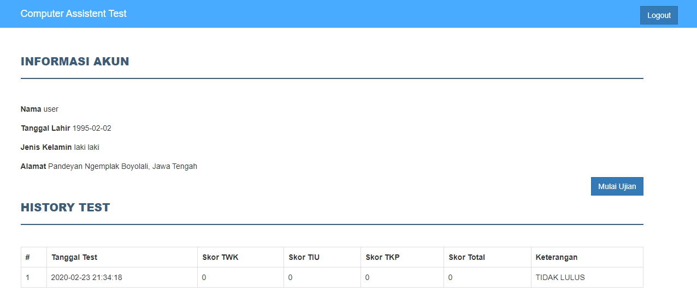
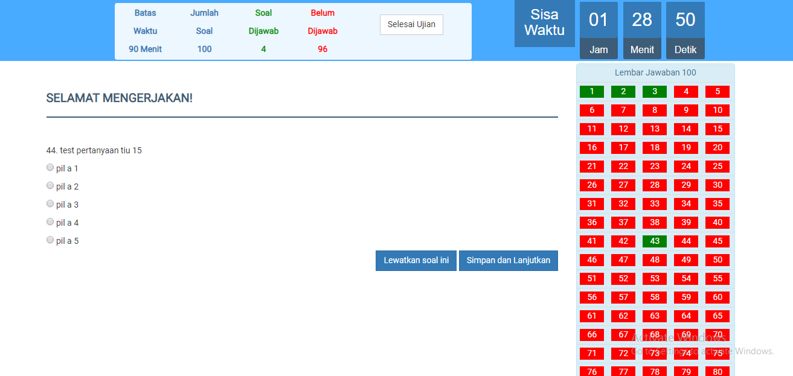
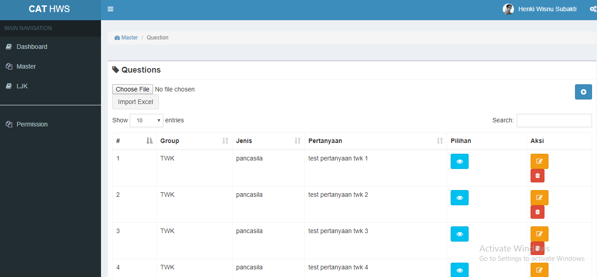

## Simulasi CAT CPNS

Aplikasi Simulasi CAT CPNS berbasis web menggunakan laravel dan MySQL. Dilengkapi dengan fitur import data soal dari excel, sehingga memudahkan untuk menambah data selain dari input manual. Semoga Bermanfaat :)

1. Halaman Login Aplikasi

2. Halaman Profile User

3. Halaman Ujian User

4. Halaman Master CAT

## Cara Instalasi
1. git clone origin 
2. composer install
3. php artisan db:seed
4. Jalankan dengan perintah 'php artisan serve'
5. Login Akun : - Admin : superadmin@mail.com (admin123) - User : user@mail.com (admin123)

Selamat Mencoba :))